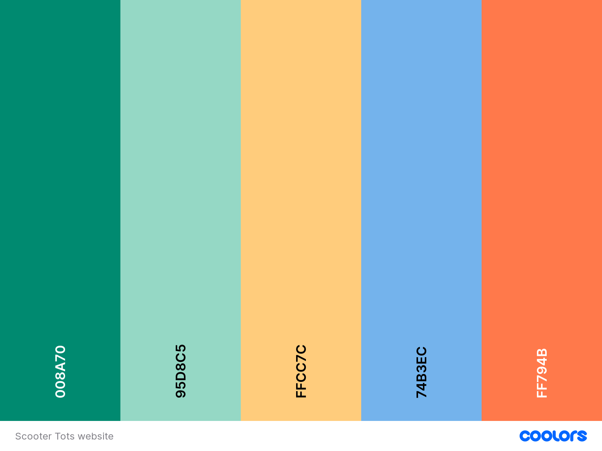

# Scooter Tots

Scooter Tots website is an advertisement for an event/club for mums, dads and other caregivers to take their preschool-aged children too. This website is for tired mums and dads with children with lots of energy and an interest in scooters, bikes and other wheelbase riding toys. It gives mums and dads an opportunity to get out of the house and socialise with other people and children an opportunity to play with friends with a similar interest. Parenting can be an isolating time, this club gives socialisation opportunities to both parent and child. This site communicates what the club is, the benefits of joining a group, where and when they plan to meet, and an opportunity to submit a form with some questions or sign up to a mailing list.

Scooter Tots website is designed to be responsive, knowing that users may access and use this website on a range of different devices.

[View Scooter Tots on Github Pages](https://aliceglan.github.io/scooter-tots/)

## User Experience (UX)

Scooter Tots main users will be people with a young child looking for opportunities of play for them. The site needs to be user friendly, bright and colourful and with clear and simple information, as most parents are sleep deprevied.

#### Key information

- What Scooter Tots is.
- When they meet.
- Where they meet.
- An opportunity toconnect with the group leader.

### User Stories

#### Client Goals

- To be able to use the site on a range of devices.
- To advertise the benefits of joinging the group.
- To make the roup appear friendly and inviting.
- To allow users to contact me to ask questions if they are worried about attending or other reasons.

#### First-Time Visitor Goals

- I want to understand what the club is about.
- I want to check the requirements for at
  tending the club.
- I want to ind out when and where the
  cub is taking place.
- I want to feel like the club is welcoming and inviting.
- I want to be updated about changes to ask a question.

#### Returning Visior Goals

- I want to check the day nd time of th group.
- I
  want to check the requirements to attend.
- I want to contact the club organiser and ask some questions.
- I want to sign up to updates about future gr
  oups and recieve the newsletter.

- I want to connect with the group on social media.

#### Frequent Visitor Goals

- I want to connect to the groups social media accounts.
- I want to check changes to group times.

## Design

### Colour Scheme

The website uses bright colours that are playful. I alo chose colours that reflec a park or outside expereince of a sunny day, with the blue sky, yellow sun and green grass. he colour pallette was created using [coolors] (https:/coolors.co/).

### Typography

Google Fonts was used for all the fonts on the site. I chose the logo font
as a curved playful font and for the main section I chose an easy to read font.

- Fira Sans is use
  for the main content
- B used for the heading logo and welcome tag line.

### Imagery

Images were sourced from [Pexels](https://www.pexels.com/search/child%20scooter/). I have chosen images that show children having fun in a range of possible similar settings that the groups might be held. I have also chosen images that reflects the use of other wheeled toys and is not specific to scooters.

## Features

The website if made up of three pages, all accesible from the main navigation. The site also has a relevant favicon of a scooter. 

#### General features
- A large Logo in the header section. 
- The header is visible through all pages even with scrolling. 
- A navigation menu that is responsive with the bar icon for mobile use and a menu list that shows underneath the logo for larger screens. 
- The navigation highlights the current page the user is on, this is visible for larger screens.
- A footer with a newsletter form and social media links. These offer the user an easily accessible chance to connect with the group.
- The form in the footer features has an input for name and email. 
- The form has a subscribe button to enter the form.
- A font awesome paper plane icon for the newsletter.
- A font awesome icon for the social media links.

#### Home page

- A large hero image with a welcome message to the group. This image is the first thing the user will see so it highlights the ethos of the club.
- A scooter animation that is child friendly and fun to highlight the ethos of the group.
- Information sections that include: our mission, benefits for tots, benefits for you, do not fear and rules of play. 
- Two sections have a list for easy access to the information.
- A font awesome icon that is relevant to the section is alongside the section headings.
- Each section has an image above it that is related to the information in some way. This is another way that makes the information easily accessible and memorable. 

#### Meet Us

- Large image of my tot, making it personal and making the group feel more welcoming and approachable offering an insight into the group leaders life.
- A tagline with an inviting message.
- The group meeting times with the day as the heading, the time and address and a map. This provides the user with multiple approaches to find the location of the group and reduces the need to contact the group leader with location questions.

#### Contact Us

- A large border used to make it appear as the form is a piece of paper.
- An animation image of hands recieving a letter with several icons to show the multiple ways to get in touch.
- A form with the following input features: 
    - name 
    - email 
    - a select option to identify which group they are interested in. This could be used to generate data to show which group is popular. 
    - text area for a message, left for the user to write various messages for various means of contact. 
- A submit button at the end of the form. 

## Deployment

The site is deployed through GitHub. I took the following steps to deploy my site: 
1. Log into GitHub and locate the repository.
2. Navigate to the settings tab. 
3. Locate 'Pages', in the code and automation section in the navigation menu on the left.
4. In the Sorce section choose 'deploy from branch'. 
5. In the Branch section select 'main' and 'root'.
6. Click save. 
7. Your deployed url will now be accesible within your repository.    

You can view Scooter Tots live page here - https://aliceglan.github.io/scooter-tots/

## Testing
Testing happened throughout the development, when I deployed early and when the build was complete. 
I often fixed bugs as soon as I found them but this meant my commit messages were not very accurate.
I used google chrome Dev tools to support building a responsive design. Most features needed adjusting when the screen size got bigger. 

When I deployed my site I had the following bugs: 
1. There was a slight gap between the navigation menu and the logo which was creating a small white line along. I used Dev tools to alter the padding. 
2. The scooter animation was very small so I changed the unit of measurement from percentage to pixles. 
3. Both buttons, subscribe and submit, were rounded edges, had a blue background, unexpected font colour and were not the size. They were inheriting a few styles. 
4. Both iframes were not working. I used Google support to trouble shoot this. 

I have tested the site on a small laptop screen, iphone 13  iphone 11, larger laptop screen. 

During my testing after the site was built I encounteded the following bugs:
1.On a larger screen the welcome message was being cut off when landing on the page. This was reduced using Dev tools to identify a optimal height. 

<!--  In this sectio
n, you need to convince the assessor that you have conducted enough testing to legitimately believe that the site works well. Essentially, in this part you will want to go over all of your project’s features and ensure that they all work as intended, with the project providing an easy and straightforward way for the users to achieve their goals.

In addition, you should mention in this section how your project looks and works on different browsers and screen sizes.

You should also mention in this section any interesting bugs or problems you discovered during your testing, even if you haven't addressed them yet.

If this section grows too long, you may want to split it off into a separate file and link to it from here. -->

### Validator Testing

<!--
- HTML

- CSS -->

### Unfixed Bugs

1. On the meet us page I wanted to have the map view in the middle. I attempted to use flex-box order in the HTML code and within CSS but was unsuccessful. 
2. the images seem to be pixalating a little and are not of high quality on the larger screens.
3. I had put in a placeholder message 

## Credits

### Code used
I used https://www.w3schools.com/ multiple times for reference, to refer back to for 
- form structure 
- form attributes 
- flex-box support 
- creating a circle, and curved edges 

I used Code institue runthrough project to support me in creating a toggling navigation menu 

I used google support to help troubleshoot my iframes not working 
https://support.google.com/maps/answer/144361?hl=en&co=GENIE.Platform%3DDesktop

i used dev tools

### Content

The content input is in my own words.

Git - For version control.

Github - To save and store the files for the website.

### Design
Google Fonts - To import the fonts used on the website.
https://coolors.co/ - for colour scheme ideas 

### Media
[Favicon.io](https://favicon.io/) To create favicon.
[Tiny PNG](https://tinypng.com/) To compress images.
pexels for the images 
[Am I Responsive?](http://ami.responsivedesign.is/) To show the website image on a range of devices.
pexels https://www.pexels.com/search/child%20scooter/

https://icons8.com/illustrations/curated-sets/animated-1 

## Acknowledgements

- How to write a Good readme (https://bulldogjob.com/news/449-how-to-write-a-good-readme-for-your-github-project)
- Accessibility and Meta Tags, by Abigail Harrison webinar (<https://www.youtube.com/watch?v=t-4qqmikIqk>)
- Kera - readme webinar
- code insitute readme structure example 
