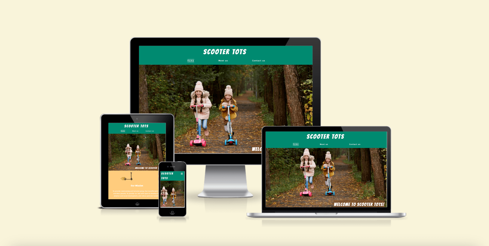

# Scooter Tots

Scooter Tots website is an advertisement for an event/club for mums, dads and other caregivers to take their preschool-aged children too. This website is for tired mums and dads with children with lots of energy and an interest in scooters, bikes and other wheelbase riding toys. It gives mums and dads an opportunity to get out of the house and socialise with other people and children an opportunity to play with friends with a similar interest. Parenting can be an isolating time, this club gives socialisation opportunities to both parent and child. This site communicates what the club is, the benefits of joining a group, where and when they plan to meet, and an opportunity to submit a form with some questions or sign up to a mailing list.

Scooter Tots website is designed to be responsive, knowing that users may access and use this website on a range of different devices.

[View Scooter Tots on Github Pages](https://aliceglan.github.io/scooter-tots/)

## User Experience (UX)

cooter Tots main users will be people with a young child looking for opportunities of play for them. The site needs to be user friendly, bright and colourful and with clear and simple information, as most parents are sleep deprevied.  #### Key informon for tite 
 - What Scooter Tots is.
 - When they meet. 
 - Where they meet. 
 - An opportunity toconnect with the group leader. 
 
### Us
er Stories

#### Client Goals 
- To be able to use the site on a range of devices.
- To advertise the benefits of joinging the group.
- To make the roup appear friendly and inviting.
- To allow us
ers to contact me to ask questions if they are worried about attending or other reasons. 

#### First-Time Visitor Goals
- I want to understand what the club is about.
- I want to check the requirements for at
tending the club.
- I want to ind out when and where the 
cub is taking place.
- I want to feel like the club is welcoming and inviting.
- I want to be updated about changes to ask a question.

#### Returning Visior Goals
- I want to check the day nd time of th group.
- I
want to check the requirements to attend.
- I want to contact the club organiser and ask some questions.
- I want to sign up to updates about future gr
oups and recieve the newsletter. 

- I want to connect with the group on social media.

#### Frequent Visitor Goals
- I want to connect to the groups social media accounts. 
- I want to check changes to group times.

---

## Design

### Colour Scheme

![Scooter Tots website colour pallet] (documentation/ST-colour-scheme.png)

The website uses bright colours that are playful. I alo chose colours that reflec a park or outside expereince of a sunny day, with the blue sky, yellow sun and green grass. he colour pallette was created using [coolors] (https:/coolors.co/). 

### Typography

Google Fonts was used for all the fonts on the site. I chose the logo font 
as a curved playful font and for the main section I chose an easy to read font. 
- Fira Sans is use
 for the main content
- B used for the heading logo and welcome tag line. 

### Imagery 
Images were sourced from [Pexels](https://www.pexels.com/search/child%20scooter/). I have chosen images that show children having fun in a range of possible similar settings that the groups might be held. I have also chosen images that reflects the use of other wheeled toys and is not specific to scooters.

## Features
The website if made up of three pages, all accesible from the main navigation.

#### General features

- favicon
- A large Logo on the header
- a navigation menu that is responsive
- navigation that highlights the active page the user is on - this is more visible for larger screens
- a footer with a newsletter form and social media links
- a font awesome icon for the newsletter
- a font awesome icon for the social media links

#### Home page

-hero image

- welcome message
- scooter animation
- information sections that include
- our mission
  - benefits for tots
  - benefits for you
  - do not fear
  - rules of play
- font awesome icons with the headings related to the content
- images above the section with a related image in some way
- two lists for the benefits

#### meet us

- Large image of my tot, making it personal and making the group feel more welcoming and approachable offering an insight into the group leaders life.
- a tagline with an inviting message
- group meeting times with the day as the heading, the time and address and a map. This provides the user with multiple approaches to find the location of the group and reduces the need to contact the group leader with location questions.

####

## Technologies Used

### Languages Used

HTML and CSS

### Frameworks, Libraries and Programs Used

Github - to save and store files for website

Favicon

Google Dev tools -

Font Awsome -

## Deployment

<!--  This section should describe the process you went through to deploy the project to a hosting platform (e.g. GitHub)

The live link can be found here -  -->

## Testing

<!--  In this sectio
n, you need to convince the assessor that you have conducted enough testing to legitimately believe that the site works well. Essentially, in this part you will want to go over all of your project’s features and ensure that they all work as intended, with the project providing an easy and straightforward way for the users to achieve their goals.

In addition, you should mention in this section how your project looks and works on different browsers and screen sizes.

You should also mention in this section any interesting bugs or problems you discovered during your testing, even if you haven't addressed them yet.

If this section grows too long, you may want to split it off into a separate file and link to it from here. -->

### Validator Testing
<!--
- HTML

- CSS -->

### Unfixed Bugs

<!--  You will need to mention unfixed bugs and why they were not fixed. This section should include shortcomings of the frameworks or technologies used. Although time can be a big variable to consider, paucity of time and difficulty understanding implementation is not a valid reason to leave bugs unfixed. -->

## Credits

### Code used

### Content

The content input in my own words (Alice Ganville) with the direction of Nancy Kimberley and Tom Kimberley.

### Design

- Header and Navigation visual design (<https://www.winterarchitects.uk/?gclid=CjwKCAjwivemBhBhEiwAJxNWNxm8HOVzSJGq8GL_aCxfT_yGHL5jYQJScM7bTfGTRp3qhnvXgDxD3hoCvw8QAvD_BwE>)
- Navigation headings (<https://www.robertslimbrick.com/> )
- Design inspiration, my client really liked this website, including features like the hero image use. (<https://www.chalkarchitects.co.uk/>)

### Media

## Acknowledgements

- [How to write a Good readme](https://bulldogjob.com/news/449-how-to-write-a-good-readme-for-your-github-project)
- Accessibility and Meta Tags, by Abigail Harrison webinar (<https://www.youtube.com/watch?v=t-4qqmikIqk>)
- Kera - readme webinar
